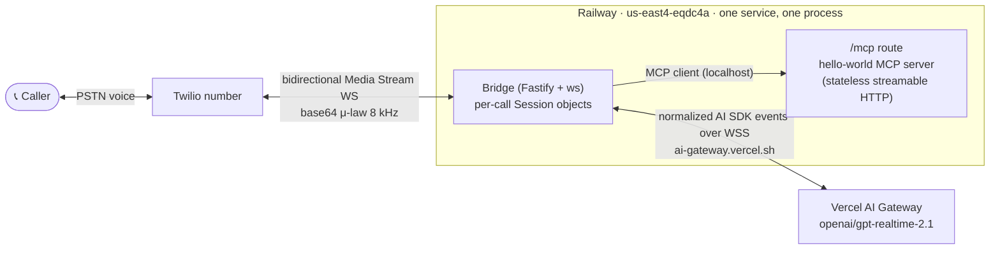
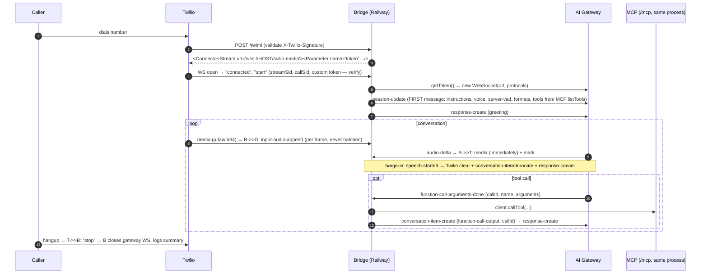

# BRD — Minimal Voice PoC: Phone → gpt-realtime-2.1 via Vercel AI Gateway

**Project:** CSUB RIO — micro proof of concept ("smallest possible voice demo")
**Author:** Kevin (Linean) · **Date:** July 2026 · **Status:** Ready for build
**Build agent note:** This document is the single source of truth for a Claude Code build-out. Everything marked **[VERIFIED]** was confirmed against primary sources (package tarballs, live APIs, vendor docs) in July 2026. Everything marked **[SPIKE]** must be tested before relying on it. Do not substitute newer package versions without reading §5.1.

---

## 1. Purpose & Scope

Demonstrate, with the least possible infrastructure and **zero new spending accounts**, that:

1. A user calls an ordinary phone number (Twilio).
2. The user holds a natural, low-latency voice conversation with **`openai/gpt-realtime-2.1`**, accessed **exclusively through Vercel AI Gateway** (existing credits; no OpenAI account/billing anywhere in this build).
3. The model can call tools on a **hello-world MCP server** mid-conversation.

The system must support **multiple simultaneous calls to the same number** (design target: 5 concurrent; acceptance test: 3–5 parallel calls). Calls are short (5–10 minutes). **Voice-conversation latency and quality are the primary things being measured** — the deliverable is as much the measured findings as the working system.

### Non-goals

No OpenAI-direct fallback (gateway-only — if the gateway path underperforms, that finding is the deliverable). No persistence/database, no auth beyond webhook validation, no observability stack beyond structured logs, no call recording, no outbound calling, no scaling beyond ~5 concurrent, no multi-provider model abstraction.

### Deployment model

Local development → push to GitHub `main` → Railway auto-deploys. One Railway service, one Node process, one repo.

---

## 2. Functional Requirements

| ID | Requirement | Acceptance |
|----|-------------|-----------|
| FR-1 | Calling the Twilio number connects the caller to a live gpt-realtime-2.1 session via AI Gateway | Call from any phone; model greets within ~2 s of pickup |
| FR-2 | Full-duplex conversation with barge-in: caller can interrupt the model mid-sentence and it stops immediately | Interrupt test: model audio stops < 500 ms after caller starts speaking |
| FR-3 | Multiple simultaneous calls on the same number, fully isolated sessions | 3–5 parallel calls; no cross-talk; each conversation independent |
| FR-4 | Model can call MCP tools mid-conversation (hello-world server: `get_current_time`, `hello`) | Ask "what time is it" → model verbally acknowledges, calls tool, speaks result |
| FR-5 | Adding an MCP tool requires zero bridge changes | Add one `registerTool` + redeploy → tool usable on next call |
| FR-6 | Per-call latency instrumentation (this is the point of the PoC) | Logs contain per-turn: speech-stopped → first audio-delta → first byte to Twilio |
| FR-7 | Graceful edges: gateway session rejection/close → spoken fallback or clean hangup, never dead air | Kill test + concurrency-limit test |
| FR-8 | Push to `main` auto-deploys to Railway | Commit → live in one step, no manual deploy actions |

## 3. Non-Functional Requirements

- **Latency target:** 1.0–1.5 s voice-to-voice p50 (server-VAD silence ~500 ms + model TTFB ~500 ms + PSTN/WS ~100–200 ms + gateway hop). Log everything; if measured worse, the logs must show which leg.
- **Cost:** Railway Hobby ($5/mo incl. usage — this app fits inside it); AI usage from existing Vercel AI Gateway credits (gpt-realtime-2.1: $4/M input, $24/M output, $0.40/M cached; pass-through, no gateway markup **[VERIFIED]** — but no audio-token-specific rate is surfaced; check the dashboard after the first billed call).
- **Constraints inherited from the gateway [VERIFIED]:** 25-min max session (fine at 5–10 min calls) · 5-min idle timeout · first client message within 30 s of connect · 256 KB max message · **team-level concurrent-session limit is unpublished** — verify in dashboard/support; design assumes ≥ 10 · reconnect does NOT resume a session.
- **Railway constraints [VERIFIED]:** redeploy sends SIGTERM with 0 s default grace → **deploys sever live calls; deploy between test calls** (we set `drainingSeconds: 60` + a SIGTERM handler as courtesy). 60 s proxy keep-alive idle timeout (moot — media frames every ~20 ms). WebSockets supported on the generated `wss://` domain out of the box.

---

## 4. Architecture

One Node/TypeScript process. Media flows Twilio ↔ bridge ↔ gateway; the bridge owns per-call state and executes tools via an in-process MCP client against its own `/mcp` route.



### Per-call sequence



---

## 5. Technical Specifications

### 5.1 Stack — pinned exactly [VERIFIED against npm, July 2026]

| Package | Version | Why pinned |
|---|---|---|
| `@ai-sdk/gateway` | **4.0.23 exact** (`save-exact`) | Realtime lives in **stable** AI SDK 7 (`latest`). ⚠️ Do **NOT** install `@canary` — the canary dist-tag (4.0.0-canary.107) is *older* than latest, and the Vercel docs pages saying "install canary" are stale (last updated pre-v7-stable). Realtime is `experimental_`-prefixed and documented to change in **patch** releases — hence exact pin. Transitive: `@ai-sdk/provider@4.0.3` defines the event protocol. |
| `@modelcontextprotocol/sdk` | **1.29.0 exact** | Stable v1 monopackage. Do NOT use the `@modelcontextprotocol/server` 2.0.0-beta split packages; v1.29's `registerTool` takes a **zod raw shape**, v2 differs — mixing them is the likeliest build failure. |
| `ws` | ^8 | WS client (gateway leg) + server (Twilio leg). Disable `perMessageDeflate` on both. |
| `fastify` | ^5 | HTTP + WS upgrade routing. (Express acceptable; examples below use Fastify.) |
| `twilio` | latest | Signature validation only. |
| `zod` | ^3.25 | MCP tool input schemas (v1.29 SDK peer). |
| Node | 22.x (`engines.node`) | Railpack default. |
| Not needed | `ai`, `@ai-sdk/react`, `openai` | The bridge programs the protocol directly; no OpenAI SDK anywhere. |

### 5.2 Gateway connection [VERIFIED from @ai-sdk/gateway@4.0.23 source]

```ts
import { gateway } from '@ai-sdk/gateway';
import WebSocket from 'ws';

const MODEL = 'openai/gpt-realtime-2.1'; // live on gateway; fallback: 'openai/gpt-realtime-2'

// Per call, at webhook time (server-side; ~100 ms; off the audio path):
const rt = gateway.experimental_realtime(MODEL);
const { token, url } = await rt.getToken({ model: MODEL, expiresAfterSeconds: 600 });
// token is a single-use short-lived 'vcst_' client secret (minted via POST /v1/realtime/client-secrets)

const cfg = rt.getWebSocketConfig({ token, url });
// url: wss://ai-gateway.vercel.sh/v4/ai/realtime-model?ai-model-id=openai/gpt-realtime-2.1
// protocols: ['ai-gateway-realtime.v1', 'ai-gateway-auth.<vcst_token>']
const gw = new WebSocket(cfg.url, cfg.protocols, { perMessageDeflate: false });
```

Wire format: the gateway model is an **identity codec** — the JSON on this WebSocket IS the normalized AI SDK event protocol (below); translation to OpenAI's wire format happens inside the gateway. `parseServerEvent` may return an event **or an array** — always handle both. `serializeClientEvent` is typed async — always `await` (it's identity for gateway, but keep the calls for forward-compat).

⚠️ **`sessionConfig` passed to `getToken` is intentionally ignored by the gateway provider** (source comment) — session config MUST be sent as a `session-update` client event after the WS opens.

### 5.3 The normalized event protocol [VERIFIED from @ai-sdk/provider@4.0.3 — vendored here so the build does not depend on docs]

**Client → gateway:**

| Event | Payload | Use |
|---|---|---|
| `session-update` | `{config}` | **First message after open** (satisfies 30 s rule). Config: `instructions`, `voice`, `turnDetection: {type:'server-vad', silenceDurationMs?, threshold?, prefixPaddingMs?}`, `inputAudioFormat`/`outputAudioFormat: {type:'audio/pcm'\|'audio/pcmu'\|'audio/pcma', rate?}`, `inputAudioTranscription: {}`, `tools: [{type:'function', name, description?, parameters: JSONSchema7}]` |
| `input-audio-append` | `{audio: base64}` | One per Twilio media frame. Under server-vad **never send `input-audio-commit`** (server commits; you receive `audio-committed`). |
| `conversation-item-create` | `{item}` | Tool results: `{type:'function-call-output', callId, name, output: JSON-string}`. Also `text-message` items for context injection. |
| `conversation-item-truncate` | `{itemId, contentIndex: 0, audioEndMs}` | Barge-in (§5.6). |
| `response-create` | `{options?}` | Greeting; after tool outputs. Model does NOT speak after tool results without this. |
| `response-cancel` | | Barge-in belt-and-braces. |
| `input-audio-clear` | | Rarely needed. |

**Gateway → client (the ones the bridge acts on):** `session-created` · `session-updated` (check `.raw` to confirm applied audio format — §5.5) · `speech-started` / `speech-stopped` (VAD; barge-in trigger) · `audio-committed` · `audio-delta {delta: base64}` (**forward to Twilio immediately, never wait for `audio-done`**) · `audio-transcript-delta/done` (model speech transcript) · `input-transcription-completed {transcript}` (caller transcript) · `output-item-added` (capture `itemId` for truncate) · `function-call-arguments-done {callId, name, arguments: JSON-string}` · `response-created` / `response-done {status}` · `error {message, code?}` · `custom {rawType, raw}` (**unmapped provider events — log these; fallback-match `rawType:'input_audio_buffer.speech_started'` if `speech-started` doesn't arrive normalized [SPIKE]**). Every server event carries `.raw` for debugging.

### 5.4 Twilio Media Streams leg [VERIFIED against Twilio docs]

- **TwiML** returned by `POST /twiml`:
  ```xml
  <Response><Connect>
    <Stream url="wss://{RAILWAY_PUBLIC_DOMAIN}/twilio-media">
      <Parameter name="token" value="{per-call random token}"/>
    </Stream>
  </Connect></Response>
  ```
  Query strings on `url` are **unsupported** — pass data via `<Parameter>` (arrives in the `start` message's `customParameters`).
- **Inbound WS events:** `connected`, `start` (has `streamSid`, `callSid`, `customParameters`, `mediaFormat` — always `audio/x-mulaw` 8000 Hz mono), `media {media:{timestamp, payload: base64 μ-law}}`, `mark` (echo), `stop`. **Frame size is not contractual** (~20 ms/160 B observed) — never assume exact sizes; keep DSP length-agnostic.
- **Outbound WS events:** `media {streamSid, media:{payload}}` (Twilio buffers and plays in order — no pacing needed), `mark {mark:{name}}` after each media send (echoed when played; powers the barge-in `audioEndMs` math), `clear {streamSid}` (flushes Twilio's playback buffer).
- **Security:** validate `X-Twilio-Signature` on `POST /twiml` with the twilio SDK. Do NOT try to validate the WS upgrade (Twilio signs the `wss://` URL while servers see `https://` — known pitfall); instead verify the per-call `<Parameter>` token in the `start` message before bridging.

### 5.5 Audio formats — the two-path decision [SPIKE = Milestone 1, ≤ 1 hour]

- **Path A (test FIRST — if it works, delete all DSP):** send `session-update` with `inputAudioFormat: {type:'audio/pcmu'}` and `outputAudioFormat: {type:'audio/pcmu'}`. The normalized protocol types this **[VERIFIED]** and OpenAI natively supports G.711 μ-law — but whether the *gateway's closed-source mapping* honors it is **unverified**. If it works, Twilio base64 payloads pass through both directions **unchanged** (zero transcoding, canonical Twilio+OpenAI demo pattern). Confirm via `session-updated.raw` + audible output.
- **Path B (baseline — implement regardless, behind a config flag):** default gateway audio is PCM16 @ 24 kHz. Bridge transcodes: inbound = μ-law decode (256-entry table) → ×3 polyphase windowed-sinc upsample (48-tap, **persistent per-call filter state** so chunk boundaries are seamless) → base64; outbound = low-pass FIR + ÷3 decimate → μ-law encode → re-frame for Twilio. Hand-roll (~100 lines) or use `alawmulaw` for the codec half; do **not** use `wave-resampler` (no streaming state → boundary clicks) or WASM libsamplerate (overkill). Benchmarked cost: **~32 µs per 20 ms frame round trip** (~0.16% of a core per call) — DSP is not the bottleneck at any realistic scale **[VERIFIED by benchmark]**.
- Message-size sanity: a 20 ms frame ≈ 1.3 KB base64 as PCM16@24k — three orders of magnitude under the 256 KB cap.

### 5.6 Barge-in (exact sequence) [VERIFIED against the AI SDK reference implementation + canonical Twilio demo]

Track per call: `latestMediaTimestamp` (from every inbound Twilio `media.timestamp`), `responseStartTimestamp` (at first `audio-delta` of each response), `lastAssistantItemId` (from `output-item-added` / `audio-delta.itemId`), and a mark queue.

On `speech-started` (or `custom.rawType === 'input_audio_buffer.speech_started'`):
1. Send Twilio `{event:'clear', streamSid}` — stops playback instantly.
2. Send `conversation-item-truncate {itemId: lastAssistantItemId, contentIndex: 0, audioEndMs: latestMediaTimestamp − responseStartTimestamp}` — aligns the model's memory with what the caller actually heard.
3. Send `response-cancel`.
4. Flush mark queue; reset `responseStartTimestamp`/`lastAssistantItemId`.

### 5.7 Tool loop via MCP [VERIFIED from protocol source — hosted/OpenAI-side MCP is definitively NOT expressible through the gateway; bridge-executed function tools are the design]

- **MCP server** (same process, `POST /mcp`): `@modelcontextprotocol/sdk@1.29.0`, **stateless** `StreamableHTTPServerTransport` (`sessionIdGenerator: undefined`, new transport + server instance per request, close both on `res.close`; 405 for GET/DELETE). Two tools via `server.registerTool(name, {description, inputSchema: <zod raw shape>}, handler)`:
  - `get_current_time` — no args → `{content:[{type:'text', text: ISO time + timezone}]}`
  - `hello` — `{name?: string}` → friendly greeting text
- **Bridge as MCP client:** at call start, `new Client(...)` + `StreamableHTTPClientTransport(new URL('http://localhost:'+PORT+'/mcp'))` → `listTools()` → map each `{name, description, inputSchema}` directly to `{type:'function', name, description, parameters: inputSchema}` in `session-update.tools`. **Per-call `listTools()` is the extension mechanism** (FR-5): add a tool = one `registerTool`, zero bridge changes.
- **The loop:** on `function-call-arguments-done {callId, name, arguments}` → `JSON.parse(arguments)` → `client.callTool({name, arguments})` → send `conversation-item-create {item:{type:'function-call-output', callId, name, output: JSON.stringify(result)}}` → **gate**: when `response-done` for the tool-bearing response has arrived AND all pending callIds have outputs, send exactly **one** `response-create`. Tool errors → send a `function-call-output` whose JSON describes the error (model apologizes verbally; call never dies silently).
- **Prompting:** include in `instructions`: *"Before calling any tool, briefly say you're checking (e.g., 'One moment, let me look that up')."* — masks the second-inference gap.
- Latency budget: localhost MCP hop is single-digit ms; the perceived cost is one extra model TTFB after `response-create`. Target total < 1.5 s.

### 5.8 HTTP surface

| Route | Purpose |
|---|---|
| `POST /twiml` | Twilio voice webhook → TwiML (signature-validated; mints per-call token; kicks off gateway `getToken` early) |
| `WS /twilio-media` | Media stream upgrade; one bridge `Session` per connection, keyed by `streamSid` |
| `POST /mcp` | Hello-world MCP (stateless streamable HTTP) |
| `GET /health` | 200 for Railway healthcheck |

Per-call `Session` object: `{ twilioWs, gatewayWs, streamSid, callSid, dspState?, markQueue, latestMediaTimestamp, responseStartTimestamp, lastAssistantItemId, pendingToolCalls, timestamps }`. Concurrency = a `Map<streamSid, Session>`; there is no shared state between calls (FR-3 falls out structurally).

### 5.9 Logging & latency instrumentation (FR-6 — this is the experiment)

One structured JSON line per **event**, never per frame (Railway caps 500 lines/s/replica): `{"message", "level", "callSid", "event", ...}`. Events: stream-start, gateway-open, session-updated (log applied `.raw` format), speech-stopped, first-audio-delta (log Δ from speech-stopped = **model+gateway TTFB**), first-twilio-send (Δ = bridge cost), tool-call (arguments→output→response-create→first follow-up delta), barge-in, error/custom (with `.raw`), stream-stop (call summary: duration, turns, p50/p95 per-turn latency). Filter in Railway Log Explorer with `@callSid:<sid>`.

---

## 6. Twilio Setup (console, once)

1. Upgrade the Twilio account if still trial (card-swipe; trial restricts inbound callers to verified numbers).
2. Buy one US local number (~$1.15/mo): Console → Phone Numbers → Buy a Number (US, Voice).
3. After the first Railway deploy (§7), set the number's **Voice Configuration**: "A call comes in" → **Webhook** → `https://<RAILWAY_PUBLIC_DOMAIN>/twiml` → HTTP POST. Save.
4. That's all — Media Streams needs no console config; the TwiML response creates the stream per call. Inbound calls have **no Twilio-side concurrency limit** (the same number fans out to unlimited parallel streams).
5. Record `TWILIO_AUTH_TOKEN` (Console dashboard) for webhook signature validation.
6. Local dev variant: point the webhook at the ngrok URL instead (§8).

## 7. Railway Setup & Deploy Pipeline (once)

1. Push the repo to GitHub. In Railway: New Project → **Deploy from GitHub repo** → select repo, branch `main`, **Enable auto-deploy**. Leave "PR Environments" and "Wait for CI" off.
2. Service → Settings → **Region: US East Metal (Virginia)** (`us-east4-eqdc4a`) — Twilio US1 and Vercel's US-East edge are both in the Virginia corridor; this is the cheapest latency win available. (Also encoded in `railway.json` below.)
3. Settings → Networking → **Generate Domain** → this hostname is `RAILWAY_PUBLIC_DOMAIN` (auto-injected as an env var) — the TwiML `wss://` host and the Twilio webhook host.
4. Variables tab (mark both **sealed**): `AI_GATEWAY_API_KEY` (from Vercel dashboard → AI Gateway → API Keys), `TWILIO_AUTH_TOKEN`.
5. Commit `railway.json` at repo root **[VERIFIED fields]**:
   ```json
   {
     "$schema": "https://railway.com/railway.schema.json",
     "build": { "builder": "RAILPACK" },
     "deploy": {
       "startCommand": "node dist/server.js",
       "healthcheckPath": "/health",
       "healthcheckTimeout": 120,
       "restartPolicyType": "ON_FAILURE",
       "restartPolicyMaxRetries": 3,
       "drainingSeconds": 60,
       "multiRegionConfig": { "us-east4-eqdc4a": { "numReplicas": 1 } }
     }
   }
   ```
   `package.json`: `"engines": {"node": "22.x"}`, `"scripts": {"build": "tsc", "start": "node dist/server.js"}` — Railpack runs `build` automatically.
6. **Operating rule: deploys sever live calls** (SIGTERM, 0 s default grace). Deploy between test calls. The SIGTERM handler should stop accepting new streams and let active calls drain (≤ 60 s).

## 8. Local Development

`.env` (never committed): `AI_GATEWAY_API_KEY`, `TWILIO_AUTH_TOKEN`, `PORT=3000`, `PUBLIC_HOST` (overrides `RAILWAY_PUBLIC_DOMAIN` locally). Run `ngrok http 3000` → point the Twilio number's webhook at `https://<ngrok>/twiml`; the TwiML builds `wss://<ngrok>/twilio-media`. **Voice quality/latency through ngrok is NOT representative** (extra tunnel hop on the media path — unlike the SIP architecture, media transits the bridge here); use local for functional dev, Railway for all latency measurements. Redis: none. Docker: none. `npm run dev` = `tsx watch src/server.ts`.

## 9. Repo Skeleton

```
voice-poc/
├── BRD.md                    # this document
├── railway.json
├── package.json              # save-exact deps per §5.1
├── tsconfig.json
├── .env.example
└── src/
    ├── server.ts             # Fastify boot: routes, WS upgrade, SIGTERM drain
    ├── twiml.ts              # POST /twiml: signature validation, token mint, TwiML
    ├── session.ts            # per-call Session: two WS legs, event loop, state machine
    ├── gateway.ts            # getToken/getWebSocketConfig wrapper, event send/recv helpers
    ├── bargein.ts            # §5.6 sequence
    ├── dsp.ts                # Path B transcoder (μ-law ⇄ PCM16-24k, streaming state) — behind AUDIO_MODE flag
    ├── tools.ts              # MCP client: listTools→definitions, callTool loop (§5.7)
    ├── mcp-server.ts         # POST /mcp: stateless streamable HTTP, registerTool × 2
    ├── logger.ts             # structured JSON events + latency timestamps
    └── config.ts             # env parsing; AUDIO_MODE=pcmu|transcode; MODEL id
```

## 10. Milestones & Acceptance

| # | Milestone | Acceptance criteria |
|---|---|---|
| M1 | **Audio-format spike + first call** (≤ half a day) | Live call answered by gpt-realtime-2.1 through the gateway. Path A (pcmu) tested first and result recorded in the README; resolve [SPIKE] items: pcmu honored? `speech-started` normalized or `custom`? `gpt-realtime-2.1` connects (else fall back `gpt-realtime-2` and note it)? |
| M2 | **Conversation quality**: barge-in + transcription + greeting | FR-2 passes; input/output transcripts in logs; latency instrumentation live |
| M3 | **Tools**: MCP loop end-to-end | FR-4 + FR-5 pass; tool round trip < 1.5 s in logs |
| M4 | **Concurrency + pipeline**: parallel calls on Railway | FR-3 (3–5 parallel), FR-7 (limit-hit behavior: reject → spoken apology/hangup), FR-8 (push → auto-deploy) pass; **empirically record the gateway team concurrent-session limit** |
| M5 | **Findings report** | README section: measured p50/p95 voice-to-voice latency, TTFB breakdown per leg, pcmu vs transcode result, concurrency ceiling, cost per call-minute from the Vercel dashboard |

## 11. Risks & Open Questions (resolve during M1/M4)

| Item | Status | Plan |
|---|---|---|
| Gateway honors `audio/pcmu` for openai models | Unverified (protocol supports it) | M1 spike; Path B baseline exists regardless |
| Team concurrent-session limit number | Unpublished anywhere | M4 empirical test; ask Vercel support; design assumes ≥ 10 |
| `speech-started` arrives normalized vs `custom` | Unverified through gateway | M1; fallback matcher specified §5.6 |
| Audio-token pricing vs listed $4/$24 per M | Gateway API surfaces no audio-specific rate | Check dashboard after first billed call (M1) |
| Gateway-hop latency overhead vs direct OpenAI | Unmeasured publicly | The instrumentation (§5.9) IS the measurement; gateway-only by design |
| `experimental_` API drift in patch releases | Documented behavior | Exact version pins; event protocol vendored in §5.3 |
| `gpt-realtime-2.1` missing `websocket-realtime` tag in models API (2 has it) | Likely metadata lag | One connect attempt at M1; fallback `openai/gpt-realtime-2` is a one-line change |

## 12. Environment Variables

```
AI_GATEWAY_API_KEY=   # Vercel dashboard → AI Gateway → API Keys (sealed on Railway)
TWILIO_AUTH_TOKEN=    # Twilio console (sealed on Railway)
PORT=                 # injected by Railway; 3000 locally
PUBLIC_HOST=          # local dev only (ngrok host); Railway uses RAILWAY_PUBLIC_DOMAIN
MODEL_ID=openai/gpt-realtime-2.1
AUDIO_MODE=transcode  # 'pcmu' after M1 spike passes
VOICE=marin
```

---

*Primary sources verified July 2026: vercel.com/docs/ai-gateway (realtime quickstart + modalities), @ai-sdk/gateway@4.0.23 + @ai-sdk/provider@4.0.3 published tarballs, ai-gateway.vercel.sh/v1/models (live), Twilio Media Streams docs (websocket-messages, TwiML <Stream>), twilio-samples/speech-assistant-openai-realtime-api-node (barge-in reference), @modelcontextprotocol/sdk@1.29.0 + official stateless streamable-HTTP example, docs.railway.com (github-autodeploys, config-as-code, public-networking specs, deployment-regions, pricing).*
